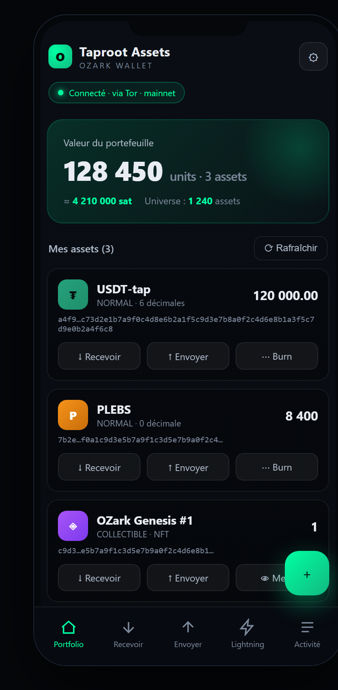
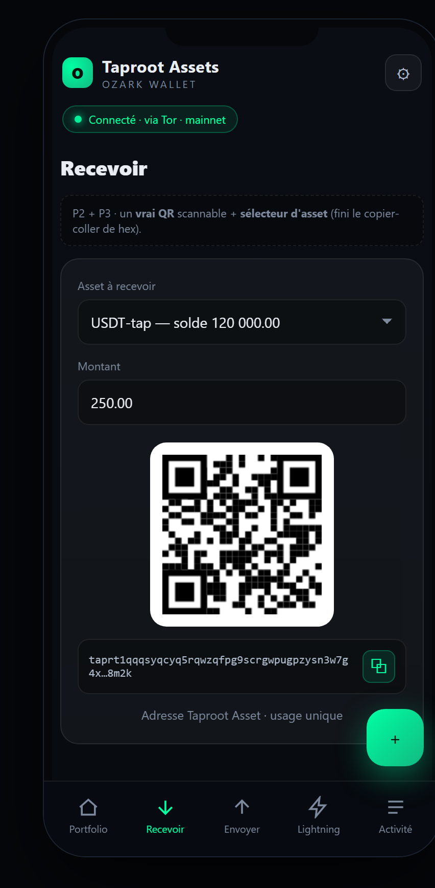
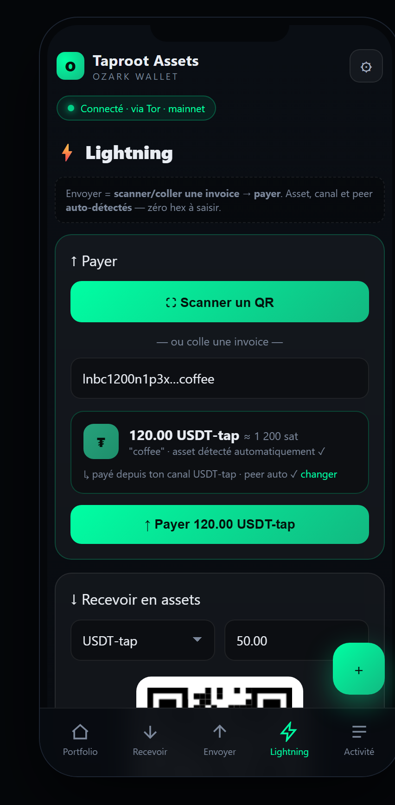
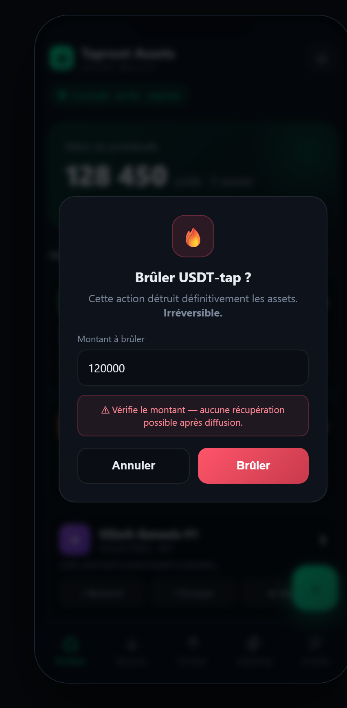

# OZark Wallet

A self-custodial Bitcoin wallet for mobile and desktop, combining on-chain Bitcoin, ARK Layer 2, Lightning payments, and Taproot Assets — with an embedded Tor client for private `.onion` connections to your own node.

<p align="center">
  
  
  
  
</p>
<p align="center"><sub>Taproot Assets UI — Portfolio · Receive (QR) · Lightning (scan-to-pay) · Burn confirmation</sub></p>

## Features

- **On-chain Bitcoin wallet** — BIP84 SegWit via BDK 3.x, synced through Esplora (Signet / Testnet / Mainnet).
- **ARK Layer 2** — integrated `bark-wallet` for fast VTXO payments, board / off-board / refresh, and unilateral on-chain exit.
- **Lightning payments** — pay and receive BOLT11 invoices through your Ark balance, with `lightning:` deep-link support.
- **Taproot Assets** — gRPC client for `tapd` to mint, list, send, receive and back up Taproot Assets proofs.
- **Embedded Tor** — `arti-client` 0.20 lets you connect to `.onion` tapd hosts without an external Tor app.
- **Self-custody security** — BIP39 seed encrypted with Stronghold and Argon2id key derivation; password never leaves the Rust backend.
- **Physical backup** — encrypted QR codes and NFC read/write on mobile.
- **Continuous delivery** — GitHub Actions builds a signed universal Android APK and publishes a GitHub Release on every `v*` tag.

## Tech Stack

| Layer | Technology |
|-------|------------|
| Frontend | React 19, TypeScript, Vite, Framer Motion |
| Backend | Rust, Tauri 2.0 |
| Bitcoin on-chain | BDK 3.x, Esplora |
| ARK L2 | `bark-wallet` |
| Lightning | Ark-native gateway |
| Taproot Assets | `tapd` gRPC |
| Tor | `arti-client` 0.20 |
| Security | Stronghold, Argon2id, AES-256-GCM |
| CI / CD | GitHub Actions, Android NDK r27b |

## Quick Start

### Prerequisites

- [Rust](https://rustup.rs/)
- [Node.js](https://nodejs.org/) ≥ 20
- [Tauri CLI v2](https://v2.tauri.app/start/prerequisites/)
- Android SDK / Xcode for mobile builds
- `protoc` is bundled locally in `tools/protoc/`

### Install & Run

```bash
npm install
npm run tauri dev          # desktop
npm run tauri android dev  # Android
npm run tauri ios dev      # iOS
```

## Project Structure

```
ark-wallet/
├── src/                  # React frontend
│   ├── screens/          # UI screens
│   └── styles/           # Futuristic glassmorphism theme
├── src-tauri/            # Rust backend
│   └── src/
│       ├── wallet/       # Seed + Stronghold vault
│       ├── onchain/      # Bitcoin on-chain wallet (BDK)
│       ├── ark/          # ARK integration (bark-wallet)
│       ├── lightning/    # Lightning invoice handling
│       ├── taproot/      # tapd gRPC client
│       ├── tor/          # Embedded Tor service
│       ├── backup/       # Encrypted QR / NFC backup
│       ├── commands.rs   # Tauri IPC commands
│       └── lib.rs
├── tools/protoc/         # Local protobuf compiler
├── docs/                 # Guides, audits and mockups
└── .planning/            # Roadmap and planning docs
```

## Taproot Assets & Tor

OZark can connect to a remote `tapd` instance over a Tor hidden service. The default values are embedded at compile time so the **Default Node** button pre-fills:

- host: `https://<your-onion>.onion:10029`
- TLS certificate
- tapd macaroon

> ⚠️ The release APK includes these defaults. If you publish the APK publicly, the macaroon is part of the binary.

To use your own node, replace the values in `src-tauri/src/tapd_defaults.rs` or build locally with a custom `tapd-defaults.json`.

## Security

- The BIP39 seed is encrypted inside a Stronghold snapshot.
- The encryption key is derived from the user password with Argon2id.
- A per-device salt is stored next to the snapshot (`.salt`) and is safe to keep public.
- The password is processed only in the Rust backend and never exposed to the frontend.
- Seed export and sensitive actions require re-entering the password.
- QR/NFC backups use AES-256-GCM with random IVs.

## Build Notes

- `bark-wallet` needs `protoc`. A local binary is provided in `tools/protoc/` and referenced from `.cargo/config.toml`.
- Android builds use NDK r27b. OpenSSL is built vendored via `openssl-sys` with custom `CC_*` / `RANLIB_*` wrappers.
- APKs are signed in CI with secrets `ANDROID_KEYSTORE_BASE64`, `ANDROID_KEYSTORE_PASSWORD`, `ANDROID_KEY_ALIAS`, and `ANDROID_KEY_PASSWORD`.

## Releases

Every push of a `v*` tag triggers the **Android Release Build** workflow, which:

1. Compiles a universal APK.
2. Signs it with the configured keystore.
3. Creates a GitHub Release and attaches both the signed and unsigned APKs.

See [releases](https://github.com/Silexperience210/OZark-wallet/releases).

## Documentation

- [User Guide](./docs/USER-GUIDE.md)
- [Security Audit](./docs/SECURITY.md)
- [Ark Exit Test Plan](./docs/TESTING-ARK-EXIT.md)
- [Roadmap](./ROADMAP.md)

## License

MIT / Apache-2.0 — by Silex.
